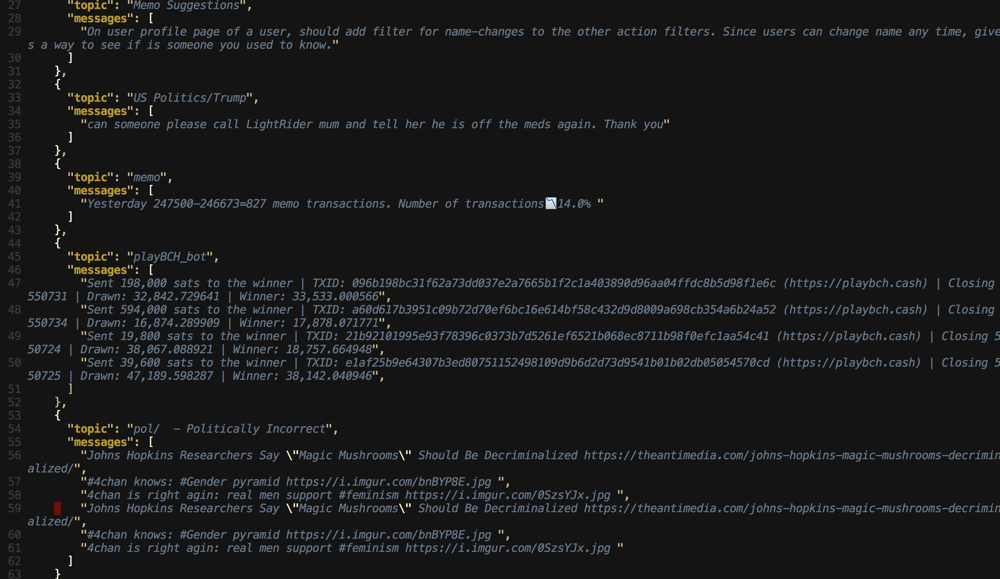

# bitqueryd

## 1. What is bitquery?

bitquery is a **Turing complete query language for building immutable API on Bitcoin**.


bitquery is a **portable**, **self-contained**, and **programmable** query language that lets you:

1. **Query** bitcoin (via [bitdb](https://bitdb.network)) using a [mongodb query language](https://docs.mongodb.com/manual/tutorial/query-documents/)
2. **Process** the result using [jq](https://en.wikipedia.org/wiki/Jq_(programming_language)), a turing complete functional programming language
3. All within a single **self-contained declarative query language**.


Top level attributes:

- v: version
- q: query (MongoDB query)
- r: response handler (powered by [jq](https://stedolan.github.io/jq/))

> Learn more here: [https://docs.bitdb.network](https://docs.bitdb.network)

With this combination, you can create your own custom API that's:

- **portable:** written in JSON, it's natively supported by all devices, OS, programming languages, and databases.
- **self-contained:** since the processing function can transform the query result into any format, the query can act as a high level API.
- **programmable:** combine with other queries to build apps that talk to one another based on bitcoin state

## 2. Build your own API from Bitcoin!

Here's a simple bitquery (You can learn more about the syntax [here](https://docs.bitdb.network/query))

```
{
  "v": 3,
  "q": {
    "find": { "out.h1": "6d0c" },
    "project": { "out.$": 1 }
  }
}
```

When you send the query to a bitdb node, it will respond with the following result:


Already super useful, but it's still raw because every item in the response is a full transaction.

We can go further by adding a **processing** step:


```
{
  "v": 3,
  "q": {
    "find": { "out.h1": "6d0c" },
    "project": {
      "out.$": 1
    }
  },
  "r": {
    "f": "[ [ .[] | .out[0] ] | group_by(.s2)[] | { topic: .[0].s2, messages: [ .[] | .s3 ] } ]"
  }
}
```

The `"r.f"` is written in [jq](https://stedolan.github.io/jq/), a [Turing complete](https://github.com/MakeNowJust/bf.jq) data processing language.

Thanks to this additional step, this will respond with:



To summarize, with bitquery:

1. **Flexible Query:** You can write a portable JSON query to read from the blockchain.
2. **Response Processing:** You can also add additional step to represent the processing logic, which will return your own custom immutable stream of data from bitcoin, or also known as **API**.
2. **Interoperable:** When you mix and match these APIs together, you can create applications that trigger and talk to one another in a deterministic manner.

---

# bitqueryd

## 1. What is bitqueryd?

bitqueryd is a query engine that:

1. Connects to a [bitdb](https://bitdb.network) node and
2. Let you interact with bitdb using the **bitquery** language.


## 2. prerequisites

bitqueryd is a query engine that directly interfaces with a BitDB node. You must have direct access to a BitDB node through either a local or remote MongoDB URL. (An HTTP based module to come soon)

> This library is for connecting directly to a BitDB MongoDB instance through `mongodb://` url and is not for HTTP access. If you're looking for a public HTTP endpoint, this library is not what you're looking for. You can instead use the HTTP-based API endpoint at [bitdb.network](https://bitdb.network), which takes only a couple of minutes to get your app up and running.

## 3. install

```
npm install --save bitqueryd
```

## 4. usage

First initialize, and use the returned db object to make the query. 

### A. Using Promises


```
var bitqueryd = require('bitqueryd')
var bql = {
  "v": 3,
  "q": {
    "find": { "out.h1": "6d02" },
    "limit": 50
  },
  "r": {
    "f": "[.[] | .out[0] | {h1: .h1, s2: .s2} ]"
  }
}
bitqueryd.init().then(function(db) {
  db.read(bql).then(function(response) {
    console.log("Response = ", response)
  })
})
```

### B. Using Async-Await

```
var bitqueryd = require('bitqueryd')
var bql = {
  "v": 3,
  "q": {
    "find": { "out.h1": "6d02" },
    "limit": 50
  },
  "r": {
    "f": "[.[] | .out[0] | {h1: .h1, s2: .s2} ]"
  }
};
(async function () {
  let db = await bitqueryd.init();
  let response = await db.read(bql);
  console.log("Response = ", response)
})();
```

> Note: By default bitquery connects to `mongodb://localhost:27017` so you don't need to configure anything if you set up BitDB without changing anything.


## 5. configuration

You can set the following two options:

1. **url:** BitDB Node URL
2. **timeout:** Request timeout

### A. url

Select the BitDB URL to connect to. 

```
bitqueryd.init({
  url: "mongodb://localhost:27017"
}).then(function(db) {
  ...
})
```

### B. timeout

Set request timeout in milliseconds. All BitDB requests will time out after this duration.

```
bitqueryd.init({
  timeout: 20000
}).then(function(db) {
  ...
})
```
